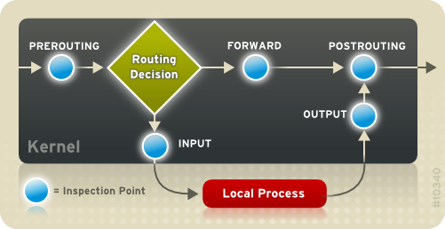

# Domain Name blocking

This lab must be made on top of lab4 ARC

## Tasks
1. Block facebook.com on Client machines
2. Using `iptables`, block jurnal.tv on XP00 and pro.tv on XP01
3. XP00 should be able to ping XP01, but not vice versa

### Implementation

The final iptables rules:

~~~bash
# From ARC Lab 4:
iptables -t nat -A POSTROUTING -o enp0s3 -j MASQUERADE

iptables -A INPUT  -i enp0s8 -j ACCEPT
iptables -A INPUT  -i enp0s9 -j ACCEPT
iptables -A INPUT  -i enp0s3 -m state --state ESTABLISHED,RELATED -j ACCEPT

iptables -A OUTPUT -j ACCEPT

# In this lab:

## Block facebook
iptables -A FORWARD           -m string --algo bm --string 'facebook'   -j DROP

## Block jurnaltv from enp0s8 aka XP00
iptables -A FORWARD -i enp0s8 -m string --algo bm --string 'jurnaltv'   -j DROP

## Block protv from enp0s9 aka XP01
iptables -A FORWARD -i enp0s9 -m string --algo bm --string 'protv'      -j DROP

## Block the icmp protocol from enp0s8 to enp0s9
iptables -A FORWARD -i enp0s8 -o enp0s9 -p icmp --icmp-typ echo-request -j DROP
~~~

### What?

Still idk

**Why FORWARD everywhere?**

We did something with nat and POSTROUTING, so I guess that's why.

Use Firefox for testing everything (not cmd nor internet explorer)

#### Blocking facebook
The rule says: block any request containing the word 'facebook'.

From what I observed, the browser sends a request to the dns server to ask what IP has facebook. Then this IP is saved. So, sometimes, it may not work because the facebook's IP is cached. Your best bet would be to reboot. Reboot в любой непонятной ситуации.

What?

Try running `tcpdump` for all intenet traffic and watch the magic happen.

#### Blocking protv & jurnaltv
The same principle, but we specify the interface we want to make the rule for

#### Blocking ping from enp0s8 ot enp0s9
Ping uses the ICMP protocol.

There's a known DoS attack: ICMP/Ping flood, still valid until today (or so the teacher says). Basically, you overwhelm a site by sending tons of `ping` commands, because ICMP is not blocked, or smth.

So, here, from enp0s8 DROP any ICMP stuff from enp0s9.

Apparently, it's required to specify that it's the ICMP protocol.

### Final result

1. From Firefox, xp00 & xp01 can't access facebook
2. From Firefox, xp00 can't access jurnaltv but can access protv.
3. From Firefox, xp01 can't access protv but can access jurnaltv
4. From cmd, xp00 can't ping xp01
5. From cmd, xp01 can ping xp00

## Conclusion
In this lab, I grasped the basics of iptables.

Iptables is one of the primary tools of a sys adming.
